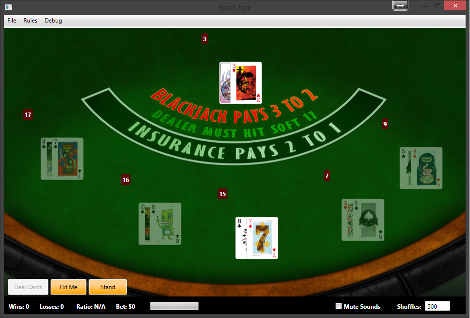

# WPF Blackjack Sample Game

This is a sample game I created years ago when I began to learn WPF and OO design. I'm ashamed of some
of the code but it's actually pretty darn good for one of my pet project apps. It was written to be a sample
app but it was also a lot of fun. I think I gave up when I couldn't figure out how to implement the card
counting algorithms.

Feel free to learn from and dissect the code. This was written when WPF was cool (hey, it still kinda is!).
Some of the code logic around decks and card counting was taken from other open source Blackjack games
back in the day (I'm sure they're still around) but I'm not sure if they all work like they're supposed to.

## TODO

- It would be neat to turn this into a Windows 8 app + C#
- If someone can implement better AI and deck dealing, be my guest
- Implement the status bar area
- Implement betting
- Implement MVVM

## License

MIT License

	Copyright (c) 2013 Kamran Ayub

	Permission is hereby granted, free of charge, to any person obtaining a copy
	of this software and associated documentation files (the "Software"), to deal
	in the Software without restriction, including without limitation the rights
	to use, copy, modify, merge, publish, distribute, sublicense, and/or sell
	copies of the Software, and to permit persons to whom the Software is
	furnished to do so, subject to the following conditions:

	The above copyright notice and this permission notice shall be included in
	all copies or substantial portions of the Software.

	THE SOFTWARE IS PROVIDED "AS IS", WITHOUT WARRANTY OF ANY KIND, EXPRESS OR
	IMPLIED, INCLUDING BUT NOT LIMITED TO THE WARRANTIES OF MERCHANTABILITY,
	FITNESS FOR A PARTICULAR PURPOSE AND NONINFRINGEMENT. IN NO EVENT SHALL THE
	AUTHORS OR COPYRIGHT HOLDERS BE LIABLE FOR ANY CLAIM, DAMAGES OR OTHER
	LIABILITY, WHETHER IN AN ACTION OF CONTRACT, TORT OR OTHERWISE, ARISING FROM,
	OUT OF OR IN CONNECTION WITH THE SOFTWARE OR THE USE OR OTHER DEALINGS IN
	THE SOFTWARE.